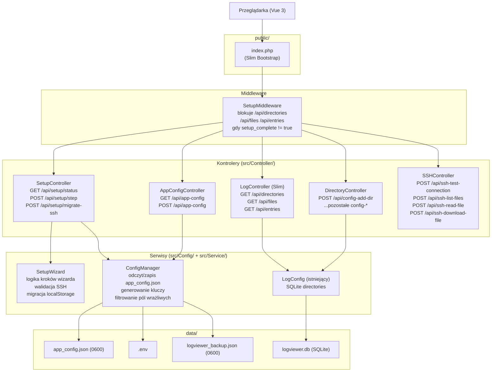
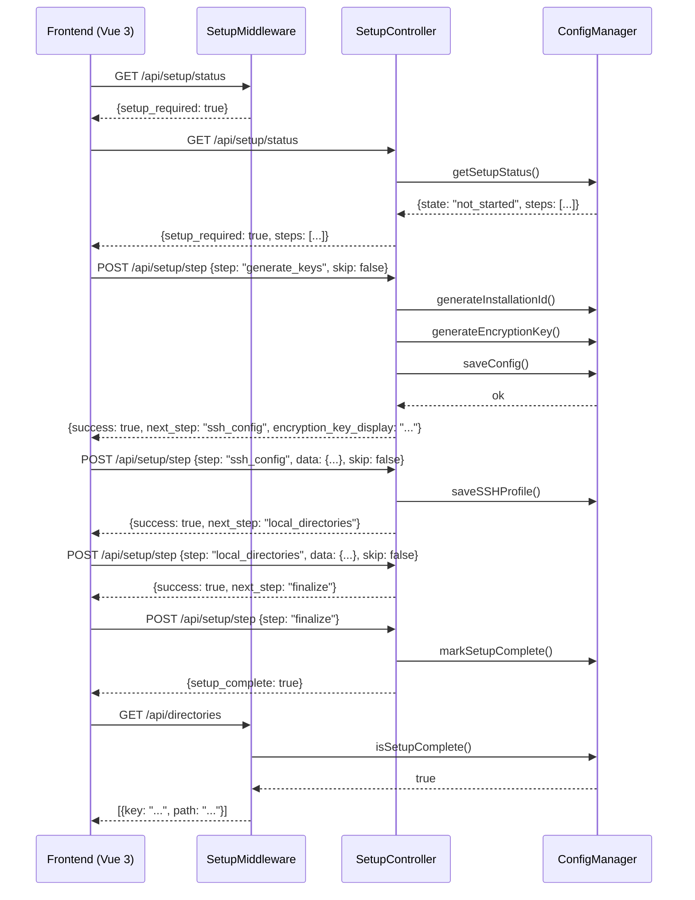

# Projekt techniczny: System konfiguracji aplikacji (app-configuration-setup)

## Overview

Niniejszy dokument opisuje projekt techniczny funkcjonalności centralnego systemu konfiguracji dla
`fast-php-log-viewer`. Celem jest zastąpienie rozproszonych danych konfiguracyjnych (localStorage,
zmienne środowiskowe, SQLite) jednym źródłem prawdy — plikiem `data/app_config.json` zarządzanym
przez nową klasę `ConfigManager`. Pierwszorazowy użytkownik przechodzi przez wizard konfiguracji
w interfejsie webowym, a połączenia SSH migrują z localStorage do trwałej konfiguracji serwerowej.

Kluczową decyzją architektoniczną jest **wprowadzenie Slim Framework 4**, który zastępuje ręczny
routing oparty na `match($_GET['action'])` w `LogController.php`. Slim dostarcza kontener DI
(PHP-DI), middleware, obsługę błędów i czysty routing REST — bez narzutu Symfony/Laravel.

---

## Decyzja architektoniczna: Slim Framework 4

### Uzasadnienie

Obecny `LogController.php` to jeden plik z globalnym `match()` i funkcjami globalnymi, co:

- uniemożliwia dependency injection (wszystkie klasy tworzone są `new` wewnątrz funkcji),
- utrudnia middleware (np. blokowanie żądań przed zakończeniem setupu),
- nie pozwala na testowanie kontrolerów w izolacji.

Slim 4 rozwiązuje te problemy minimalnym kosztem:

| Problem          | Rozwiązanie Slim 4                                    |
|------------------|-------------------------------------------------------|
| Brak DI          | PHP-DI jako kontener (domyślny z Slim 4)              |
| Brak middleware  | `SetupMiddleware` blokuje logi gdy setup niekompletny |
| Globalny routing | `RouteCollector` z grupami `/api/`                    |
| Testowanie       | Kontrolery jako klasy z wstrzykniętymi zależnościami  |

### Nowe zależności composer

```json
{
  "require": {
    "php": ">=8.1",
    "ext-pdo": "*",
    "ext-ssh2": "*",
    "ext-pdo_sqlite": "*",
    "slim/slim": "^4.12",
    "slim/psr7": "^1.7",
    "php-di/php-di": "^7.0"
  }
}
```

### Jak zmienia architekturę

```
Przed:
  public/index.php
    → if (?action) → require LogController.php
      → match($action) → function respondXxx()

Po:
  public/index.php
    → Slim App bootstrap (src/Bootstrap/app.php)
      → SetupMiddleware (blokuje logi gdy setup_complete != true)
      → RouteCollector:
          GET  /api/setup/status
          POST /api/setup/step
          POST /api/setup/migrate-ssh
          GET  /api/app-config
          POST /api/app-config
          GET  /api/directories
          GET  /api/files
          GET  /api/entries
          POST /api/config-add-dir
          ...
```

Stary `LogController.php` zostaje **zrefaktorowany** — jego funkcje globalne przepisywane są do klas
kontrolerów. Podczas migracji `index.php` obsługuje obie ścieżki (stary `?action=` i nowy `/api/`)
przez kompatybilny routing Slim.

---

## Architecture

### Diagram komponentów



### Diagram przepływu wizarda



---

## Components and Interfaces

### ConfigManager (`src/Config/ConfigManager.php`)

```php
namespace Mariusz\LogViewer\Config;

class ConfigManager
{
    public function __construct(
        private readonly string $configPath,  // data/app_config.json
        private readonly string $envPath,     // .env
    ) {}

    // --- Stan setupu ---
    public function isSetupComplete(): bool;
    public function getSetupStatus(): array;       // {state, steps[]}
    public function markSetupComplete(): void;
    public function getSetupState(): string;       // not_started|in_progress|complete|skipped

    // --- Generowanie danych ---
    public function generateInstallationId(): string;   // UUID v4
    public function generateEncryptionKey(): string;    // 64-char hex

    // --- Odczyt/zapis konfiguracji ---
    public function getConfig(): array;                 // pełna konfiguracja (raw)
    public function getPublicConfig(): array;           // filtruje pola wrażliwe
    public function saveConfig(array $config): void;    // atomowy zapis + chmod 0600
    public function updateConfig(array $partial): void; // częściowa aktualizacja

    // --- SSH Profiles ---
    public function saveSSHProfile(array $profileData): void;  // usuwa hasła przed zapisem
    public function getSSHProfiles(): array;                    // bez pól wrażliwych
    public function isSshEnabled(): bool;

    // --- Env ---
    public function saveEncryptionKeyToEnv(string $hexKey): bool;

    // --- Backup ---
    public function exportBackup(): void;

    // --- Bezpieczeństwo ---
    public function checkFilePermissions(): void;   // loguje ostrzeżenie gdy > 0640
    private function filterSensitiveFields(array $data): array;
    private function validateAndWriteJson(string $path, array $data): void;
}
```

### SetupWizard (`src/Service/SetupWizard.php`)

```php
namespace Mariusz\LogViewer\Service;

class SetupWizard
{
    public const STEPS = ['generate_keys', 'ssh_config', 'local_directories', 'finalize'];

    public function __construct(
        private readonly ConfigManager $configManager,
        private readonly LogConfig $logConfig,
    ) {}

    public function getStatus(): array;
    public function processStep(string $step, array $data, bool $skip): array;
    public function migrateSSHFromLocalStorage(array $connections): array;
    public function getSkipWarning(string $step): string;
    public function getNextStep(string $currentStep): ?string;

    private function processGenerateKeys(array $data, bool $skip): array;
    private function processSSHConfig(array $data, bool $skip): array;
    private function processLocalDirectories(array $data, bool $skip): array;
    private function processFinalize(array $data, bool $skip): array;
    private function validateSSHFields(array $data): ?array;   // zwraca null lub ['fields'=>[...]]
}
```

### SetupController (`src/Controller/SetupController.php`)

```php
namespace Mariusz\LogViewer\Controller;

class SetupController
{
    public function __construct(
        private readonly SetupWizard $wizard,
        private readonly ResponseFactoryInterface $responseFactory,
    ) {}

    public function getStatus(Request $request, Response $response): Response;
    public function postStep(Request $request, Response $response): Response;
    public function postMigrateSSH(Request $request, Response $response): Response;
}
```

### AppConfigController (`src/Controller/AppConfigController.php`)

```php
namespace Mariusz\LogViewer\Controller;

class AppConfigController
{
    public function __construct(
        private readonly ConfigManager $configManager,
        private readonly ResponseFactoryInterface $responseFactory,
    ) {}

    public function getConfig(Request $request, Response $response): Response;
    public function patchConfig(Request $request, Response $response): Response;
}
```

### SetupMiddleware (`src/Middleware/SetupMiddleware.php`)

```php
namespace Mariusz\LogViewer\Middleware;

class SetupMiddleware implements MiddlewareInterface
{
    private const PROTECTED_ROUTES = [
        '/api/directories', '/api/files', '/api/entries',
    ];

    public function __construct(private readonly ConfigManager $configManager) {}

    public function process(ServerRequestInterface $request, RequestHandlerInterface $handler): ResponseInterface
    {
        $path = $request->getUri()->getPath();
        if (in_array($path, self::PROTECTED_ROUTES) && !$this->configManager->isSetupComplete()) {
            // zwróć 503 {"error": "setup_required"}
        }
        return $handler->handle($request);
    }
}
```

### Bootstrap (`src/Bootstrap/app.php`)

```php
// Tworzy Slim\App z PHP-DI, rejestruje middleware i trasy
use DI\ContainerBuilder;
use Slim\Factory\AppFactory;

$containerBuilder = new ContainerBuilder();
$containerBuilder->addDefinitions(require __DIR__ . '/container.php');
$container = $containerBuilder->build();

AppFactory::setContainer($container);
$app = AppFactory::create();

$app->addBodyParsingMiddleware();
$app->addErrorMiddleware(false, true, true);
$app->add(SetupMiddleware::class);

// Routing
require __DIR__ . '/routes.php';

return $app;
```

---

## Routing — mapa endpointów

Wszystkie trasy zdefiniowane w `src/Bootstrap/routes.php`:

```php
// Setup Wizard
$app->get('/api/setup/status',        [SetupController::class, 'getStatus']);
$app->post('/api/setup/step',         [SetupController::class, 'postStep']);
$app->post('/api/setup/migrate-ssh',  [SetupController::class, 'postMigrateSSH']);

// App Config
$app->get('/api/app-config',          [AppConfigController::class, 'getConfig']);
$app->post('/api/app-config',         [AppConfigController::class, 'patchConfig']);

// Log API (chronione przez SetupMiddleware)
$app->get('/api/directories',         [LogController::class, 'getDirectories']);
$app->get('/api/files',               [LogController::class, 'getFiles']);
$app->get('/api/entries',             [LogController::class, 'getEntries']);

// Default directories (źródło prawdy, bez DB)
$app->get('/api/config/default-directories',  [DirectoryController::class, 'getDefaultDirectories']);

// Directory Config
$app->post('/api/config/directories',          [DirectoryController::class, 'add']);
$app->put('/api/config/directories/{id}',      [DirectoryController::class, 'update']);
$app->delete('/api/config/directories/{id}',   [DirectoryController::class, 'delete']);

// Scan
$app->get('/api/scan/directories',    [DirectoryController::class, 'scanDirectories']);

// SSH
$app->post('/api/ssh/test-connection', [SSHController::class, 'testConnection']);
$app->post('/api/ssh/list-files',      [SSHController::class, 'listFiles']);
$app->post('/api/ssh/read-file',       [SSHController::class, 'readFile']);
$app->post('/api/ssh/download-file',   [SSHController::class, 'downloadFile']);
```

### Kompatybilność wsteczna

Podczas migracji `public/index.php` zachowuje obsługę parametru `?action=` przez mapę aliasów:

```php
$legacyActionMap = [
    'directories'                   => '/api/directories',
    'files'                         => '/api/files',
    'entries'                       => '/api/entries',
    'config-add-dir'                => '/api/config/directories',
    'config-update-dir'             => '/api/config/directories/' . ($_GET['id'] ?? '0'),
    'config-delete-dir'             => '/api/config/directories/' . ($_GET['id'] ?? '0'),
    'ssh-test-connection'           => '/api/ssh/test-connection',
    'ssh-list-files'                => '/api/ssh/list-files',
    'ssh-read-file'                 => '/api/ssh/read-file',
    'ssh-download-file'             => '/api/ssh/download-file',
    'setup-status'                  => '/api/setup/status',
    'setup-step'                    => '/api/setup/step',
    'setup-migrate-ssh'             => '/api/setup/migrate-ssh',
    'app-config'                    => '/api/app-config',
];
```

Frontend Vue.js jest aktualizowany aby używać nowych URL-i `/api/...` zamiast `?action=`.

---

## Data Models

### Schemat `data/app_config.json`

```json
{
  "installation_id": "a1b2c3d4-e5f6-4a7b-8c9d-0e1f2a3b4c5d",
  "setup_state": "complete",
  "setup_complete": true,
  "backup_encryption_enabled": true,
  "ssh_enabled": true,
  "created_at": "2026-06-10T12:00:00+00:00",
  "updated_at": "2026-06-10T12:05:00+00:00",
  "setup_steps": {
    "generate_keys": "complete",
    "ssh_config": "complete",
    "local_directories": "skipped",
    "finalize": "complete"
  },
  "ssh_profiles": [
    {
      "id": "profile_1",
      "name": "Serwer produkcyjny",
      "ssh_host": "192.168.1.100",
      "ssh_user": "deploy",
      "ssh_port": 22,
      "ssh_auth_method": "key",
      "ssh_key_path": "/root/.ssh/id_rsa",
      "ssh_key_path_original": "/home/mariusz/.ssh/id_rsa",
      "ssh_key_path_warning": true,
      "remote_path": "/var/log",
      "all_files": false,
      "migrated_from_localstorage": true
    }
  ],
  "local_directories": [
    {
      "name": "Logi aplikacji",
      "path": "/var/log/app",
      "type": "local"
    }
  ]
}
```

#### Opis pól

| Pole                        | Typ              | Wymagane | Opis                                                |
|-----------------------------|------------------|----------|-----------------------------------------------------|
| `installation_id`           | string (UUID v4) | tak      | Unikalny ID instalacji, generowany jednorazowo      |
| `setup_state`               | enum             | tak      | `not_started`, `in_progress`, `complete`, `skipped` |
| `setup_complete`            | bool             | tak      | Shortcut — true gdy wszystkie kroki zakończone      |
| `backup_encryption_enabled` | bool             | tak      | Czy backup jest szyfrowany AES-256-GCM              |
| `ssh_enabled`               | bool             | tak      | Czy funkcja SSH jest aktywna                        |
| `created_at`                | ISO 8601         | tak      | Timestamp pierwszego zapisu                         |
| `updated_at`                | ISO 8601         | tak      | Timestamp ostatniego zapisu                         |
| `setup_steps`               | object           | tak      | Status każdego z 4 kroków                           |
| `ssh_profiles`              | array            | nie      | Profile SSH (bez haseł!)                            |
| `local_directories`         | array            | nie      | Katalogi lokalne skonfigurowane przez wizarda       |

#### Pola nigdy niezapisywane

Następujące pola są **nigdy** nie zapisywane w pliku ani zwracane przez API:

- `ssh_password`
- `ssh_key_passphrase`
- `encryption_key_raw`

Klucz szyfrowania (`BACKUP_ENCRYPTION_KEY`) trafia wyłącznie do pliku `.env`.

### SSHProfile (obiekt w tablicy `ssh_profiles`)

| Pole                         | Typ          | Opis                                                 |
|------------------------------|--------------|------------------------------------------------------|
| `id`                         | string       | Unikalne ID profilu (`profile_N`)                    |
| `name`                       | string       | Nazwa czytelna dla użytkownika                       |
| `ssh_host`                   | string       | Hostname lub IP                                      |
| `ssh_user`                   | string       | Nazwa użytkownika SSH                                |
| `ssh_port`                   | int          | Port SSH (domyślnie 22)                              |
| `ssh_auth_method`            | enum         | `password` lub `key`                                 |
| `ssh_key_path`               | string\|null | Ścieżka do klucza prywatnego w kontenerze            |
| `ssh_key_path_original`      | string\|null | Oryginalna ścieżka z hosta (przy migracji)           |
| `ssh_key_path_warning`       | bool         | true gdy ścieżka może być nieprawidłowa w kontenerze |
| `remote_path`                | string       | Ścieżka zdalna do przeszukania                       |
| `all_files`                  | bool         | Czy listować wszystkie pliki (bez filtrowania)       |
| `migrated_from_localstorage` | bool         | true gdy zmigrowane z localStorage                   |

---

## Migracja — integracja z istniejącym LogController

### Plan migracji krok po kroku

1. **Krok 1** — Dodanie Slim + PHP-DI do `composer.json`, stworzenie `src/Bootstrap/app.php`, `container.php`,
   `routes.php`.
2. **Krok 2** — Przepisanie `public/index.php` tak, żeby bootstrapował Slim zamiast bezpośrednio includować
   `LogController.php`. Zachowanie aliasów `?action=` przez mapę.
3. **Krok 3** — Stworzenie nowych kontrolerów Slim (`SetupController`, `AppConfigController`, `LogController` Slim,
   `DirectoryController`, `SSHController`). Każdy kontroler deleguje do istniejących serwisów (nie kopiuje logiki).
4. **Krok 4** — Stary `src/Controller/LogController.php` przestaje być includowany bezpośrednio i staje się archiwum.
   Jego logika jest przenoszona do nowych kontrolerów Slim.
5. **Krok 5** — Frontend `app.js` aktualizuje URL-e z `?action=X` na `/api/X`.

### Przykład — migracja funkcji `respondDirectories()`

Przed (stary `LogController.php`):

```php
function respondDirectories(): void {
    // ...ręczne tworzenie LogConfig, JSON output
}
```

Po (nowy `LogController.php` Slim):

```php
class LogController
{
    public function __construct(
        private readonly LogConfig $logConfig,
        private readonly ConfigManager $configManager,
    ) {}

    public function getDirectories(Request $request, Response $response): Response
    {
        $dirs = $this->logConfig->getDirectories();
        if (!$this->configManager->isSshEnabled()) {
            $dirs = array_filter($dirs, fn($d) => ($d['type'] ?? 'local') !== 'ssh');
        }
        $response->getBody()->write(json_encode(array_values($dirs)));
        return $response->withHeader('Content-Type', 'application/json');
    }
}
```

---

## Frontend — zmiany w `app.js`

### 1. Sprawdzenie stanu setupu przy starcie

Funkcja `init()` ładuje najpierw status setupu:

```javascript
async function init() {
    // Sprawdź status setupu przed załadowaniem katalogów
    const status = await fetchJson('/api/setup/status');
    if (status.setup_required) {
        showSetupWizard.value = true;
        return; // nie ładuj katalogów dopóki setup niekompletny
    }

    // Pobierz konfigurację z serwera zamiast z localStorage
    const config = await fetchJson('/api/app-config');
    sshEnabled.value = config.ssh_enabled ?? true;

    // Zsynchronizuj profile SSH z serwera do localStorage
    if (config.ssh_profiles && config.ssh_profiles.length) {
        const profiles = config.ssh_profiles.map(p => ({
            name: p.name, host: p.ssh_host, user: p.ssh_user,
            port: p.ssh_port || 22, authMethod: p.ssh_auth_method || 'password',
            keyPath: p.ssh_key_path || '', remotePath: p.remote_path || '/var/log',
            allFiles: p.all_files || false,
        }));
        localStorage.setItem('fplv_ssh_connections', JSON.stringify(profiles));
        sshConnections.value = profiles;
    }

    // Załaduj katalogi domyślne (z API, nie hardcodowane)
    await loadDefaultDirectories();

    // Załaduj katalogi (teraz z serwera, nie localStorage)
    await loadDirectories();
    // ...
}
```

### 2. Migracja SSH z localStorage

Jednorazowa migracja przy pierwszym uruchomieniu po aktualizacji:

```javascript
async function migrateSSHIfNeeded() {
    const stored = localStorage.getItem('fplv_ssh_connections');
    if (!stored) return;

    const connections = JSON.parse(stored);
    if (!connections.length) return;

    const res = await fetch('/api/setup/migrate-ssh', {
        method: 'POST',
        headers: { 'Content-Type': 'application/json' },
        body: JSON.stringify({ connections })
    });
    const data = await res.json();
    if (data.migrated >= 0) {
        localStorage.removeItem('fplv_ssh_connections');
        if (data.warnings?.length) {
            console.warn('SSH migration warnings:', data.warnings);
        }
    }
}
```

### 3. Nowe stany Vue dla wizarda

```javascript
// Setup Wizard State
const showSetupWizard = ref(false);
const setupSteps = ref([]);
const currentSetupStep = ref('');
const setupSkipConfirm = ref(false);
const setupStepData = reactive({});
const setupWarning = ref('');
```

### 4. Zmiana URL-i API

Wszystkie wywołania `fetch` zmieniają format z:

```javascript
fetch('?action=directories')       // stary format
```

na:

```javascript
fetch('/api/directories')          // nowy format
```

Kompatybilność wsteczna przez serwer (mapa aliasów) zapewnia płynne przejście.

### 5. Wizard UI — szkic komponentu

```html
<!-- Setup Wizard (Vue conditional) -->
<div v-if="showSetupWizard" class="fixed inset-0 flex items-center justify-center z-50"
     style="background:rgba(0,0,0,0.95);">
    <div class="rounded shadow-lg p-6" style="background:#000;border:1px solid #00ff00;width:600px;">
        <h2 class="text-sm font-bold crt-glow mb-4">⚡ KONFIGURACJA APLIKACJI</h2>

        <!-- Krok: generate_keys -->
        <div v-if="currentSetupStep === 'generate_keys'">
            <p class="text-xs crt-text mb-4">Aplikacja wygeneruje klucz szyfrowania i unikalny ID instalacji.</p>
            <div v-if="setupWarning" class="mb-3 p-2 text-xs" style="border:1px solid #ffff00;color:#ffff00;">
                ⚠ {{ setupWarning }}
            </div>
            <div v-if="!setupSkipConfirm" class="flex gap-2">
                <button @click="proceedStep(false)" class="flex-1 crt-button py-1 text-xs">Generuj klucze</button>
                <button @click="setupSkipConfirm = true" class="flex-1 crt-button py-1 text-xs"
                        style="border-color:#ff6600;color:#ff6600;">Pomiń</button>
            </div>
            <div v-else class="flex gap-2">
                <p class="text-xs" style="color:#ff6600;">Backup nie będzie szyfrowany. Potwierdź pominięcie:</p>
                <button @click="proceedStep(true)" class="crt-button py-1 text-xs px-3"
                        style="border-color:#ff0000;color:#ff0000;">Rozumiem, pomiń</button>
                <button @click="setupSkipConfirm = false" class="crt-button py-1 text-xs px-3">Wróć</button>
            </div>
        </div>
        <!-- Kolejne kroki analogicznie -->
    </div>
</div>
```

---

## Domyślne katalogi (Default Directories)

### Źródło prawdy: `LogConfig::getDefaultDirectories()`

Statyczna metoda w `src/Config/LogConfig.php` zwraca 4 wbudowane wpisy:

| `key` | `path` | `type` | `name` | Opis |
|---|---|---|---|---|
| `docker:/var/log` | `/var/log` | `docker` | `Kontener (Docker)` | Logi w kontenerze |
| `host:/var/log` | `/host/var/log` | `host` | `Host (Ubuntu)` | Logi na hoście |
| `host-home:~/logs` | `/host/home/logs` | `home` | `Host (~/logs)` | Logi w ~/logs na hoście |
| `repository:logs` | `logs/` | `repository` | `Aplikacja (logs/)` | Logi w katalogu aplikacji |

### Przepływ w dropdownie

1. Frontend ładuje defaults przez `GET /api/config/default-directories` → `DirectoryController::getDefaultDirectories()`
2. Frontend ładuje zapisane katalogi przez `GET /api/directories` → `LogController::getDirectories()` → `LogConfig::getValidDirectories()`
3. `mergedDirectories` (Vue computed) grupuje je: **"Domyślne"**, **"Zapisane"**, **"SSH"**
4. Przy wyborze defaulta (`docker:/var/log`): frontend wysyła `dir=<key>`, backend parsuje klucz przez `LogController::resolveDirPath()`:
   - Klucze z `:` → wyciąga ścieżkę po dwukropku
   - Klucze absolutne (`/`) → używa bezpośrednio
   - Klucze zwykłe → szuka w SQLite po `name`

### Domyślny wybór

Przy starcie `loadDirectories()` wybiera pierwszy dostępny katalog z grupy "Domyślne" (zamiast hardcodowanego `docker:/var/log`).

---

## Audyt i oczyszczenie kodu (2026-06-24)

### Usunięty martwy kod z `LogConfig`

- `addDefaultDirectories()` — nigdy nie wywoływana, używała `LogScanner` do auto-populacji SQLite
- `removeDuplicates()` — nigdy nie wywoływana, zawierała zduplikowane zapytanie SQL
- `removeAllowedEntries()` — nigdy nie wywoływana, logika częściowo w `cleanupAuto()`
- Import `LogScanner` — nieużywany po usunięciu `addDefaultDirectories()`

### Poprawki

- `SetupWizard::processLocalDirectories()` — usunięte martwe przypisanie `$config['local_directories']`
- Frontend: `loadDirectories()` wybiera pierwszy default zamiast hardcodowanego `docker:/var/log`
- Frontend: `init()` synchronizuje `ssh_profiles` z API `/api/app-config` do localStorage
- Testy SSH z frog (`frog01.mikr.us`) — oznaczone jako `markTestSkipped` (serwer niedostępny)

---

## Correctness Properties

*Właściwość to cecha lub zachowanie, które powinno być prawdziwe dla wszystkich prawidłowych
wykonań systemu — jest to formalne stwierdzenie tego, co system powinien robić. Właściwości
stanowią pomost między czytelną dla człowieka specyfikacją a weryfikowalnymi gwarancjami
poprawności.*

### Analiza redundancji

Przed spisaniem właściwości — przegląd prework pod kątem redundancji:

- **Wymagania 4.3, 9.2 i 6.2** dotyczą filtrowania pól wrażliwych: 4.3 dla pliku, 6.2/9.2/9.3
  dla odpowiedzi API. Można je połączyć w jedną właściwość "filtrowanie wrażliwych pól".
- **Wymagania 2.1 i 2.2** dotyczą generowania kluczy — każde testuje inny aspekt (UUID vs hex),
  więc zostają osobno, ale można je pogrupować.
- **Wymagania 3.3 i 8.1** dotyczą pola `warning` przy `skip=true` — można połączyć w jedną
  właściwość.
- **Wymagania 1.1 i 1.4** testują `isSetupComplete()` z różnych perspektyw — można połączyć.
- **Wymagania 6.1 i 6.3** dotyczą atomowości zapisu JSON — można połączyć (round-trip + atomowość).

Po refleksji: właściwości 1, 2, 3, 4, 5, 6, 7, 8, 9, 10.

---

### Property 1: Detekcja stanu setupu jest zawsze poprawna

*Dla dowolnej zawartości pliku `app_config.json` (lub jego braku), metoda `isSetupComplete()`
zwraca `true` wtedy i tylko wtedy, gdy plik istnieje, jest prawidłowym JSON i zawiera pole
`setup_complete` o wartości dokładnie `true`. Dla wszystkich pozostałych przypadków (brak pliku,
pole `false`, pole `null`, pole nieobecne, uszkodzony JSON) metoda zwraca `false`.*

**Validates: Requirements 1.1, 1.2, 1.3, 1.4**

---

### Property 2: Wygenerowane InstallationId są zawsze prawidłowymi UUID v4

*Dla dowolnej liczby wywołań `generateInstallationId()`, każdy zwrócony ciąg pasuje do formatu
UUID v4 (`/^[0-9a-f]{8}-[0-9a-f]{4}-4[0-9a-f]{3}-[89ab][0-9a-f]{3}-[0-9a-f]{12}$/i`) oraz
żadne dwa zwrócone identyfikatory nie są identyczne.*

**Validates: Requirements 2.1**

---

### Property 3: Wygenerowane EncryptionKey są zawsze prawidłowymi 64-znakowymi ciągami hex

*Dla dowolnej liczby wywołań `generateEncryptionKey()`, każdy zwrócony ciąg ma dokładnie 64
znaki i zawiera wyłącznie znaki `[0-9a-f]` (lowercase hex). Żadne dwa wygenerowane klucze
nie są identyczne.*

**Validates: Requirements 2.2**

---

### Właściwość 4: Serializacja konfiguracji jest odwracalna (round-trip)

*Dla dowolnej struktury tablicy PHP reprezentującej konfigurację (zawierającej dowolne kombinacje
pól konfiguracyjnych), zapisanie jej przez `saveConfig()` a następnie odczytanie przez `getConfig()`
zwraca strukturę równoważną oryginałowi. Wynikowy plik JSON jest zawsze prawidłowym JSON
z wcięciami (`JSON_PRETTY_PRINT`).*

**Validates: Requirements 6.1, 6.3**

---

### Właściwość 5: Pola wrażliwe nigdy nie opuszczają systemu

*Dla dowolnej konfiguracji zawierającej dowolne wartości pól wrażliwych (`ssh_password`,
`ssh_key_passphrase`, `encryption_key_raw`), zarówno plik `data/app_config.json` jak i odpowiedź
metody `getPublicConfig()` nigdy nie zawierają żadnego z tych pól ani ich wartości.*

**Validates: Requirements 4.3, 6.2, 9.2, 9.3**

---

### Właściwość 6: Każdy zapis konfiguracji ustawia uprawnienia 0600

*Dla dowolnej zawartości konfiguracji zapisanej przez `saveConfig()`, po każdym wywołaniu plik
`data/app_config.json` ma uprawnienia dokładnie `0600` (odczyt i zapis tylko dla właściciela).*

**Validates: Requirements 2.6, 9.1**

---

### Właściwość 7: Każdy krok z `skip=true` zawsze zwraca niepuste pole `warning`

*Dla każdego z czterech kroków wizarda (`generate_keys`, `ssh_config`, `local_directories`,
`finalize`) przetwarzanego z parametrem `skip=true`, wynik metody `processStep()` zawiera
pole `warning` będące niepustym ciągiem znaków.*

**Validates: Requirements 3.3, 8.1, 8.2**

---

### Właściwość 8: Setup jest kompletny dla dowolnej kombinacji complete/skipped kroków

*Dla dowolnej konfiguracji gdzie każdy z czterech kroków (`generate_keys`, `ssh_config`,
`local_directories`, `finalize`) ma status `complete` lub `skipped` (ale nie `pending`),
metoda `isSetupComplete()` zwraca `true`. Jeśli jakikolwiek krok ma status `pending`,
metoda zwraca `false`.*

**Validates: Requirements 3.4, 3.5**

---

### Właściwość 9: Walidacja SSH odrzuca dane bez wymaganych pól

*Dla dowolnych danych wejściowych kroku `ssh_config` z `skip=false`, które nie zawierają
pola `ssh_host` lub nie zawierają pola `ssh_user` (lub obu), metoda `validateSSHFields()`
zwraca tablicę zawierającą nazwy brakujących pól. Dla danych zawierających oba pola
(niepuste), walidacja przechodzi bez błędu.*

**Validates: Requirements 4.1**

---

### Właściwość 10: Filtrowanie katalogów SSH przy wyłączonej funkcji SSH

*Dla dowolnej listy katalogów zawierającej dowolne kombinacje katalogów lokalnych (`type=local`)
i SSH (`type=ssh`), gdy `ssh_enabled=false` w konfiguracji, metoda `getDirectories()` zwraca
wyłącznie katalogi z `type != 'ssh'`. Gdy `ssh_enabled=true`, katalogi SSH są uwzględniane.*

**Validates: Requirements 4.5**

---

## Bezpieczeństwo

### Uprawnienia plików

| Plik                         | Uprawnienia | Kiedy ustawiane                                       |
|------------------------------|-------------|-------------------------------------------------------|
| `data/app_config.json`       | `0600`      | Po każdym zapisie przez `ConfigManager::saveConfig()` |
| `data/logviewer_backup.json` | `0600`      | Po każdym eksporcie przez `exportBackup()`            |
| `.env`                       | Bez zmiany  | Nie modyfikujemy uprawnień istniejącego pliku .env    |

Przy każdym wczytaniu `app_config.json`, `ConfigManager` sprawdza uprawnienia — jeśli szersze
niż `0640`, loguje ostrzeżenie do `data/php_errors.log`.

### Filtrowanie pól wrażliwych

Prywatna metoda `ConfigManager::filterSensitiveFields(array $data): array` rekursywnie przechodzi
przez tablicę i usuwa klucze:

```php
private const SENSITIVE_KEYS = ['ssh_password', 'ssh_key_passphrase', 'encryption_key_raw'];
```

Metoda jest wywoływana przed każdym `json_encode()` w `getPublicConfig()` i przed zapisem
profili SSH w `saveSSHProfile()`.

### Atomowy zapis JSON

`ConfigManager::validateAndWriteJson()` implementuje wzorzec write-then-rename:

```php
private function validateAndWriteJson(string $path, array $data): void
{
    $json = json_encode($data, JSON_PRETTY_PRINT | JSON_UNESCAPED_UNICODE | JSON_THROW_ON_ERROR);
    $tmp = $path . '.tmp.' . bin2hex(random_bytes(4));
    file_put_contents($tmp, $json);
    // Weryfikacja: odczytaj i porównaj
    $verify = json_decode(file_get_contents($tmp), true);
    if ($verify === null) {
        unlink($tmp);
        throw new \RuntimeException('Wygenerowany JSON jest nieprawidłowy');
    }
    rename($tmp, $path);  // atomowa operacja na tym samym filesystemie
    chmod($path, 0600);
}
```

### Ochrona przed path traversal

`SetupMiddleware` i `LogController` walidują ścieżki plików przez `realpath()` i porównanie
prefiksu ze skonfigurowanymi katalogami — ta logika pochodzi z istniejącego `LogController.php`
(funkcja `respondEntries()`) i jest zachowana bez zmian.

### Nieujawnianie EncryptionKey przez API

`EncryptionKey` wyświetlany jest **jednorazowo** — tylko w odpowiedzi na krok `generate_keys`
w polu `encryption_key_display`. Nie jest przechowywany w `app_config.json`. Po wyświetleniu
klucz jest dostępny wyłącznie z pliku `.env` na serwerze.

---

## Error Handling

### Mapowanie wyjątków na kody HTTP

| Wyjątek / sytuacja                                    | Kod HTTP            | Odpowiedź JSON                                         |
|-------------------------------------------------------|---------------------|--------------------------------------------------------|
| Setup niekompletny, żądanie do chronionych endpointów | `503`               | `{"error": "setup_required"}`                          |
| Brakujące pole w kroku SSH                            | `400`               | `{"error": "missing_fields", "fields": ["ssh_host"]}`  |
| Nieprawidłowy JSON w ciele żądania                    | `400`               | `{"error": "invalid_json"}`                            |
| Nieznany krok wizarda                                 | `400`               | `{"error": "unknown_step", "step": "..."}`             |
| Plik `.env` niezapisywalny                            | `200` (nie blokuje) | `{"warning": "env_not_writable", "message": "..."}`    |
| Plik poza dozwolonymi katalogami                      | `403`               | `{"error": "access_denied"}`                           |
| Błąd zapisu `app_config.json`                         | `500`               | `{"error": "config_write_failed"}`                     |
| Połączenie SSH nie powiodło się                       | `500`               | `{"error": "ssh_connection_failed", "message": "..."}` |

### Slim ErrorMiddleware

Wszystkie nieprzechwycone wyjątki (`\Throwable`) są obsługiwane przez `Slim\Middleware\ErrorMiddleware`
skonfigurowane z `displayErrorDetails=false` (produkcja) i logowaniem do `data/php_errors.log`.

### Degraceful failure dla ConfigManager

Jeśli `app_config.json` jest uszkodzony (nieprawidłowy JSON), `ConfigManager::getConfig()` zwraca
pustą tablicę domyślną i loguje błąd — nie rzuca wyjątku. Dzięki temu wizard jest zawsze
dostępny, nawet po uszkodzeniu konfiguracji.

---

## Testing Strategy

### Podwójne podejście

Testy są podzielone na dwa uzupełniające się rodzaje:

- **Testy jednostkowe** — konkretne przykłady, edge-case'y, integracja z systemem plików
- **Testy property-based** — właściwości universalne (patrz sekcja Właściwości poprawności)

### Biblioteka PBT

Projekt używa **eris** (`giorgiosironi/eris`) jako biblioteki property-based testing dla PHP:

```json
"require-dev": {
    "phpunit/phpunit": "^11.0",
    "giorgiosironi/eris": "^0.14"
}
```

Każdy test property uruchamiany jest minimum **100 razy** przez generator.

### Klasy testowe

#### `tests/Config/ConfigManagerTest.php`

Testy jednostkowe dla `ConfigManager`:

```php
// Przykłady jednostkowe:
public function testIsSetupCompleteReturnsFalseWhenFileDoesNotExist(): void
public function testIsSetupCompleteReturnsFalseWhenSetupCompleteIsFalse(): void
public function testIsSetupCompleteReturnsTrueWhenSetupCompleteIsTrue(): void
public function testSaveConfigCreatesFileWithCorrectPermissions(): void
public function testGetPublicConfigFiltersSensitiveFields(): void
public function testSaveConfigWithInvalidDataKeepsPreviousVersion(): void
public function testCheckFilePermissionsLogsWarningWhenPermissionsAreTooOpen(): void
public function testSaveEncryptionKeyToEnvWritesKeyToFile(): void
public function testSaveEncryptionKeyToEnvReturnsFalseWhenEnvNotWritable(): void
public function testSaveSSHProfileExcludesPasswordFields(): void
```

#### `tests/Config/ConfigManagerPropertyTest.php`

Testy property-based dla `ConfigManager` (z eris):

```php
use Eris\Generator;
use Eris\TestTrait;

class ConfigManagerPropertyTest extends TestCase
{
    use TestTrait;

    // Property 1: isSetupComplete()
    // Feature: app-configuration-setup, Property 1: Setup detection is always correct
    public function testIsSetupCompleteOnlyTrueForExactlyTrue(): void

    // Property 2: generateInstallationId() format UUID v4
    // Feature: app-configuration-setup, Property 2: Generated InstallationIds are valid UUID v4
    public function testGeneratedInstallationIdsAreValidUUIDv4(): void

    // Property 3: generateEncryptionKey() format hex
    // Feature: app-configuration-setup, Property 3: Generated EncryptionKeys are 64-char hex
    public function testGeneratedEncryptionKeysAre64CharHex(): void

    // Property 4: round-trip serialization
    // Feature: app-configuration-setup, Property 4: Config serialization is reversible
    public function testConfigRoundTrip(): void

    // Property 5: sensitive fields never exposed
    // Feature: app-configuration-setup, Property 5: Sensitive fields never leave the system
    public function testSensitiveFieldsNeverInPublicConfig(): void

    // Property 6: permissions 0600 after every save
    // Feature: app-configuration-setup, Property 6: Every config save sets 0600 permissions
    public function testFilePermissionsAfterSave(): void

    // Property 7: skip always produces warning
    // Feature: app-configuration-setup, Property 7: Every skipped step produces a warning
    public function testSkippedStepAlwaysHasWarning(): void

    // Property 8: setup complete for any complete/skipped combination
    // Feature: app-configuration-setup, Property 8: Setup is complete for any complete/skipped combination
    public function testSetupCompleteForAnyCompleteSkippedCombination(): void

    // Property 9: SSH validation rejects missing fields
    // Feature: app-configuration-setup, Property 9: SSH validation rejects data without required fields
    public function testSSHValidationRejectsMissingFields(): void

    // Property 10: SSH directories filtered when ssh_enabled=false
    // Feature: app-configuration-setup, Property 10: SSH directories filtered when ssh disabled
    public function testSSHDirectoriesFilteredWhenDisabled(): void
}
```

#### `tests/Service/SetupWizardTest.php`

```php
public function testProcessGenerateKeysReturnsEncryptionKeyDisplay(): void
public function testProcessSSHConfigSkipSetsSSHDisabled(): void
public function testProcessSSHConfigRequiresSshHostAndUser(): void
public function testProcessSSHConfigWithKeyPathWarnsWhenKeyNotFound(): void
public function testMigrateSSHFromLocalStorageReturnsCountAndWarnings(): void
public function testMigrateSSHFromLocalStorageWithEmptyArrayReturnsZero(): void
public function testGetNextStepReturnsCorrectSequence(): void
public function testFinalizeMarksSetsupComplete(): void
public function testSkipGenerateKeysReturnNoEncryptionWarning(): void
```

#### `tests/Middleware/SetupMiddlewareTest.php`

```php
public function testBlocksDirectoriesWhenSetupIncomplete(): void
public function testAllowsSetupEndpointsWithoutSetup(): void
public function testAllowsDirectoriesWhenSetupComplete(): void
```

#### `tests/Controller/SetupControllerTest.php`

Testy kontrolera z PSR-7 mock requests:

```php
public function testGetStatusReturnsSetupRequired(): void
public function testPostStepProcessesStep(): void
public function testPostStepWithUnknownFieldsIgnoresThem(): void
public function testPostMigrateSSHAcceptsConnections(): void
```

### Uruchamianie testów

```bash
# Wszystkie testy
vendor/bin/phpunit --run

# Tylko property tests
vendor/bin/phpunit --run --filter PropertyTest

# Z verbose output dla property failures
vendor/bin/phpunit --run --testdox
```

### Balans testów jednostkowych vs property

- Unikaj duplikowania — jeśli właściwość jest testowana przez PBT, nie twórz dodatkowych
  jednostkowych testów dla tych samych przypadków (PBT generuje ich setki).
- Testy jednostkowe skupiają się na: integracji z systemem plików, konkretnych komunikatach
  błędów, konkretnych kolejnościach kroków wizarda.
- Testy property skupiają się na: właściwościach logiki (generowanie kluczy, filtrowanie,
  serialization round-trip, uprawnienia).
